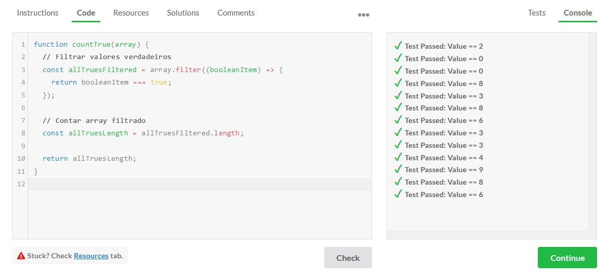

# V_Camp Desafio Edabit

## Instruções

Olá,

Bem-vindo ao V_Camp.

Gostaríamos de propor a você um pequeno exercício. Vamos lá?

1. Visite o site https://edabit.com/challenges
2. Selecione uma linguagem para o desafio. Preferencialmente JavaScript (candidatos front-end) ou Java (candidatos back-end), mas sinta-se à vontade para usar C#, PHP, Python ou Ruby também.
3. Selecione a dificuldade a partir de Medium.
4. Realize o desafio, guardando o código de sua solução e uma captura da correção (mais detalhes a seguir).

Qual desafio escolher? Qualquer um! O importante é seguir as seguintes instruções de entrega:

1. Crie um repositório público no GitHub seguindo a nomenclatura **vcamp-edabit-linguagem-nome-do-teste** (ex.: vcamp-edabit-javascript-how-much-is-true).
2. Adicione uma captura da correção (testes) em formato de imagem.
3. Adicione um arquivo README com:

- A captura (imagem) dos testes passando na plataforma
- Link do desafio realizado
- Comentários (opcional)

4. Adicione um arquivo com extensão adequada (ex.: index.js) com sua resposta.
5. Adicione @brunosfreitas e @andrelom como colaboradores de seu repositório quando tiver finalizado.

> **Importante:** Seja o mais declarativo possível, deixando bem claro o funcionamento do seu algoritmo. Use a abordagem que tiver mais familiaridade (adição de comentários, organização de escopos e nomeação de dados, etc). Confira o exemplo neste repositório.

---

## Exemplo

Captura dos testes:

Endereço do desafio:  
https://edabit.com/challenge/GLbuMfTtDWwDv2F73
